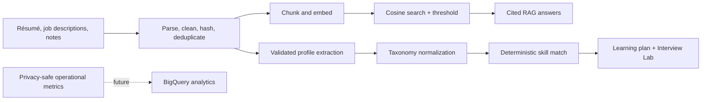

# DataPrep AI

[Live Streamlit demo](https://olegzas-pro.streamlit.app/)

DataPrep AI is a data engineering career intelligence platform. It combines
retrieval-augmented generation (RAG), validated AI extraction, deterministic skill
matching, and interview coaching in one Python web application.

The project began as a class RAG assignment and is being developed into a master's
application and data engineering portfolio project. Its product goal is simple: help
data engineers turn their own résumé, target roles, and study material into a focused
preparation plan.

## What it does

### Document Q&A

- Reads TXT, Markdown, and PDF documents.
- Cleans, chunks, hashes, and deduplicates content.
- Reuses embeddings inside the private browser session.
- Ranks chunks with normalized cosine similarity and a configurable threshold.
- Produces answers with visible `[S1]`, `[S2]` source citations and chat history.
- Reports document status, cache behavior, chunk counts, and latency.

### Career Match

- Extracts schema-validated candidate and job profiles with the OpenAI Responses API.
- Normalizes skills through a controlled data engineering taxonomy.
- Calculates a transparent match score: required skills receive weight 2 and
  preferred skills receive weight 1.
- Shows résumé and job evidence for every match or gap.
- Generates a prioritized four-week learning plan.
- Includes synthetic sample documents so the public demo does not require personal data.

### Interview Lab

- Creates SQL, Python, data modeling, system design, and behavioral questions.
- Targets the selected role and supports three difficulty levels.
- Scores answers on technical accuracy, clarity, tradeoff reasoning, and production
  readiness using a deterministic 100-point total.
- Keeps progress in the browser session and exports it as JSON.

### Market Knowledge

- Uses OpenAI web search for current data engineering tools, skills, and trends.

## Architecture



See [the architecture notes](docs/ARCHITECTURE.md) and
[the V2 roadmap](docs/V2_ROADMAP.md) for design decisions and remaining work.

## Tech stack

- Python 3.13 and Streamlit
- OpenAI Responses API, structured outputs, embeddings, and web search
- Pydantic data contracts and NumPy retrieval
- PyPDF document ingestion
- Pytest and Streamlit AppTest
- GitHub Actions
- BigQuery-ready analytics schemas (cloud integration is the next phase)

## Local setup

From PowerShell in the repository root:

```powershell
python -m venv .venv
.\.venv\Scripts\python.exe -m pip install -r requirements-dev.txt
Copy-Item .env.example .env
```

Add your API key to `.env`; never commit that file. The model defaults in
`.env.example` can be changed without editing Python.

Run the app:

```powershell
.\.venv\Scripts\python.exe -m streamlit run app.py
```

Expected result: four tabs named **Document Q&A**, **Career Match**,
**Interview Lab**, and **Market Knowledge**. In Career Match, leave the synthetic
sample option selected and click **Analyze career match** for the quickest demo.

## Quality checks

Run the offline automated suite (no API spending):

```powershell
.\.venv\Scripts\python.exe -m pytest
```

Run the retrieval benchmark (small embeddings API cost):

```powershell
.\.venv\Scripts\python.exe scripts\evaluate_retrieval.py --top-k 4 --min-score 0.25 --output evals\retrieval_quality.json
```

The current ten-case benchmark reports `Hit@4 = 1.00` and `MRR = 0.883`.
Its measured warm pass took 0.048 seconds with zero API calls, compared with
16.096 seconds for the cold pass—a 335× speedup in that run. GitHub Actions runs
the offline test suite for every push and pull request.

## Privacy and cost controls

- Uploaded content, embeddings, extracted profiles, and interview history remain in
  the current Streamlit browser session.
- The user can clear the document index and download interview history.
- Analytics contracts intentionally exclude document text, file names, answers, and
  API keys.
- `.env`, Streamlit secrets, caches, and virtual environments are ignored by Git.
- OpenAI requests have a configurable 60-second timeout and one retry so failures do
  not leave the interactive app waiting indefinitely.
- Public rate limits and a hard cloud budget are still required before a broad launch.

## Current boundary

The complete local MVP and cloud-ready analytics data model are implemented. The next
phase requires the repository owner to create a Google Cloud project, attach billing,
and provide credentials. Follow [GCP setup](docs/GCP_SETUP.md) when ready; no cloud
resources are required to run or demonstrate the current version.

## Example demo flow

1. Open Career Match and analyze the synthetic résumé and job.
2. Explain the weighted match, evidence table, and missing skills.
3. Generate the four-week plan.
4. Open Interview Lab, answer one targeted question, and show rubric feedback.
5. Open Document Q&A and ask, “How does BigQuery partitioning improve performance?”
6. Mention the measured retrieval benchmark, session cache, validated schemas, and
   privacy-safe BigQuery design.
